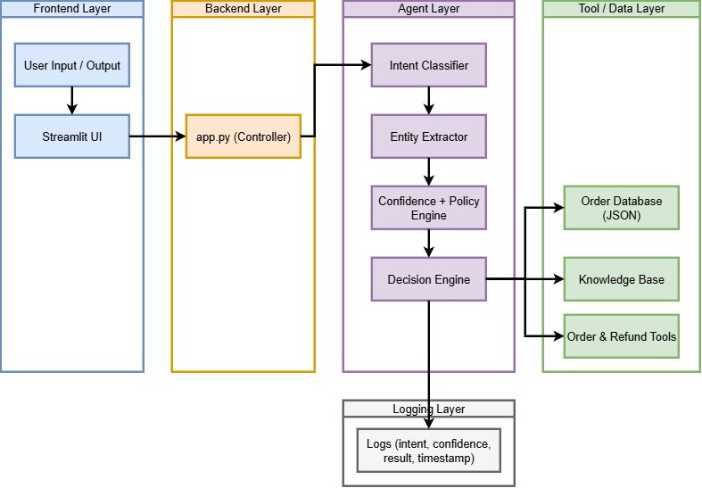

# 🤖 Autonomous Support Agent
📄 Resume: [View Resume](https://drive.google.com/uc?export=view&id=1c4fee6qOrX5RnAH-jiqsnqoYNYKdUmJ2)

An intelligent, production-ready AI agent that processes customer support tickets using **tool-based reasoning, policy-driven decisions, and real-world business logic**.

---

## 🚀 Overview

This project simulates an autonomous customer support system capable of:

- Understanding user queries (intent detection)
- Extracting key entities (order ID, issue type)
- Interacting with backend tools (order DB, customer DB, knowledge base)
- Applying business rules (refund policy, return window, escalation logic)
- Providing accurate, explainable responses

---

## 🧠 Key Features

### ✅ Intelligent Decision Making
- Intent classification (refund, order status, cancel, etc.)
- Entity extraction (order ID, customer email)
- Policy-based reasoning

### 🛠 Tool-Based Architecture
- `get_order`, `get_customer`, `get_product`
- `search_knowledge_base`
- `issue_refund`, `escalate`

### 📊 Real-World Business Logic
- Refund eligibility checks
- Return window validation
- VIP & premium overrides
- High-value refund escalation (> $200)
- Exchange-first strategy for wrong items

### 🔁 Robust Error Handling
- Safe tool calls with retry mechanism
- Fallback handling instead of hard failures
- Graceful degradation with escalation

### 📈 Confidence Scoring
- Dynamic confidence based on result & errors
- Transparent reasoning via logs

---

## 🏗️ Architecture

The system follows a **layered architecture**:


### 1. Frontend Layer
- Streamlit UI for user interaction

### 2. Backend Layer
- `app.py` acts as controller

### 3. Agent Layer
- Intent Classifier
- Entity Extractor
- Decision Engine
- Confidence Scorer
- Policy Engine

### 4. Tool / Data Layer
- Order Database (JSON)
- Customer Database
- Product Database
- Knowledge Base

### 5. Logging Layer
- Tracks:
  - Steps taken
  - Decisions
  - Confidence score
  - Errors

---
## 🚀 Deployment

This project is deployed on Render.

### 🔧 Setup Instructions

1. Clone the repository
2. Install dependencies:

   ```bash
   pip install -r requirements.txt
   ```
3. Run the app:

   ```bash
   streamlit run app.py

   ```
---  

### 🌐 Live Demo

👉 [[Add your Render link here]](https://autonomous-agent-swis.onrender.com/)

### 🚀 Live Demo Video

👉 🎥 **Watch the Demo Video:**  
  [Click here to view the demo](https://drive.google.com/file/d/1mcGg8OshIf6_VtFdI6vXKMcNZkd8LBEt/view?usp=sharing)

---

## 📌 Evaluation Criteria Alignment

This project was built keeping in mind:

- **Architecture** → Modular agent + tool system  
- **Resilience** → Retry logic + failure handling  
- **Impact** → Real-world customer support automation  

---

## 🙌 Acknowledgment

Built during the **Ksolves Agentic AI Hackathon 2026**  
as part of exploring real-world autonomous systems.

---

## 💬 Feedback

Open to feedback, suggestions, and improvements!
### ⚠️ Note

If deployment fails, ensure that:

* `requirements.txt` is present in the root directory
* All dependencies are correctly listed

## ⚙️ Installation & Setup

```bash
# Clone repo
git clone: https://github.com/your-username/your-repo.git](https://github.com/Khushboo1976/Autonomous-Agent
cd your-repo

# Install dependencies
pip install -r requirements.txt
 .\.venv\Scripts\activate
# Run app
streamlit run app.py

